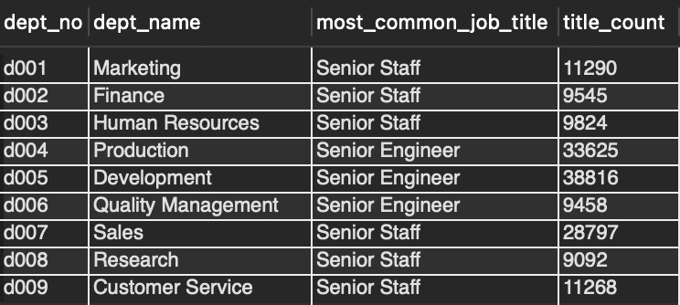
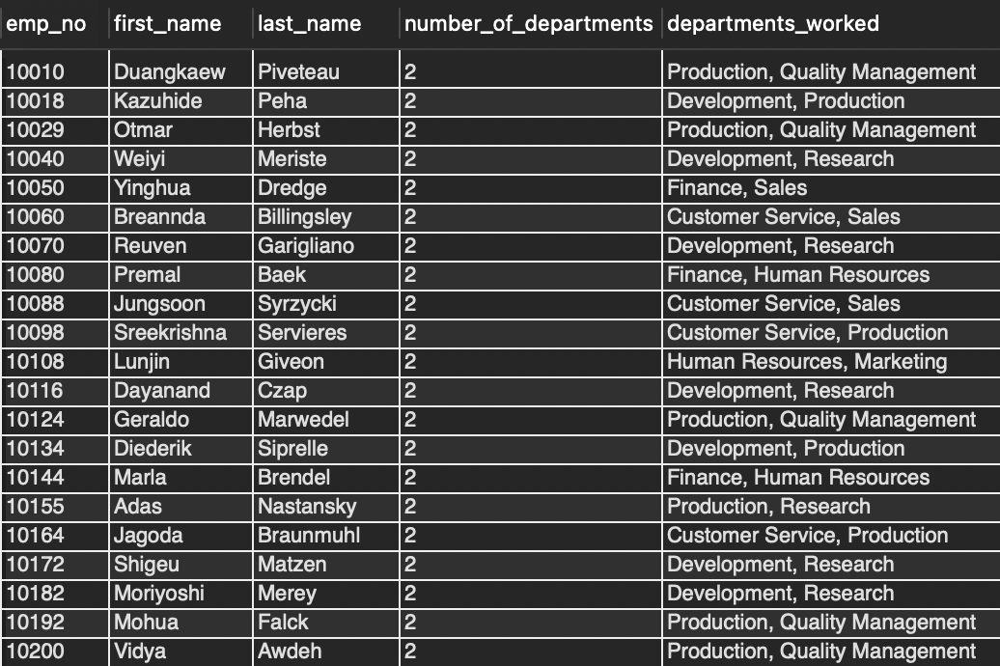
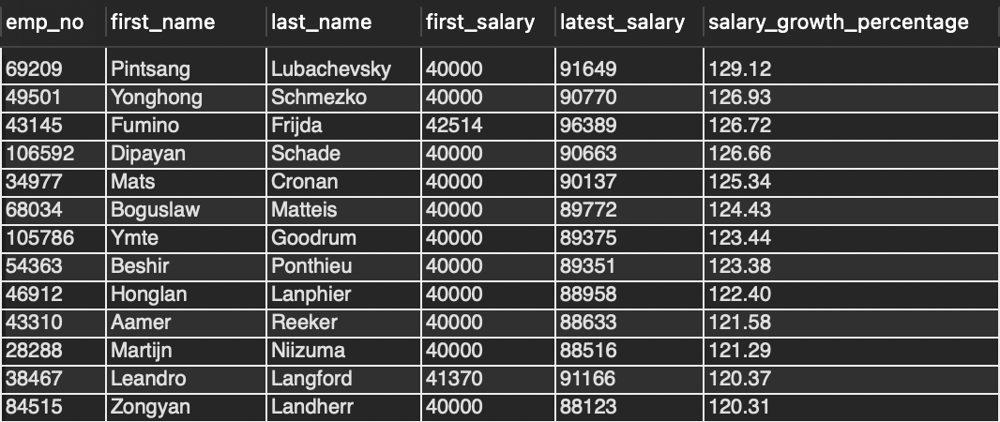
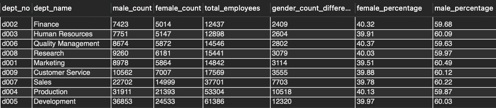
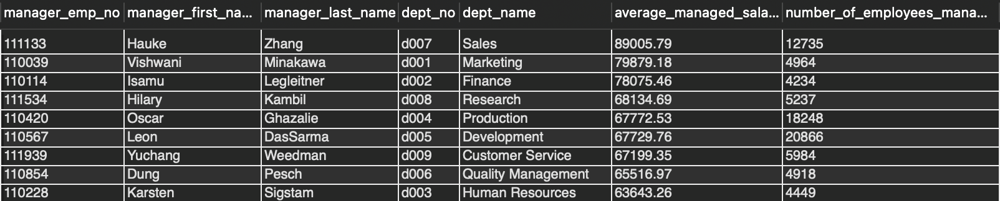

# Employee SQL Analysis Project

## Project Overview

This project analyzes employee, department, salary, title, and manager data using SQL. The project is based on the MySQL Employees Sample Database and focuses on answering practical business questions related to workforce structure, salary patterns, department changes, gender distribution, and department-level summaries.

The main goal of this project is to demonstrate SQL skills including joins, aggregation, subqueries, common table expressions, window functions, views, and stored procedures.

## Dataset

This project uses the MySQL Employees Sample Database.

The database contains employee-related tables such as:

* `employees`
* `departments`
* `dept_emp`
* `dept_manager`
* `salaries`
* `titles`

The full database is not included in this repository because it is a publicly available sample database and can be installed separately.

## SQL Skills Demonstrated

This project demonstrates the following SQL techniques:

* `JOIN`
* `GROUP BY`
* `HAVING`
* `CASE`
* `COUNT`, `AVG`, `MIN`, `MAX`
* Common Table Expressions, also known as CTEs
* Window functions such as `ROW_NUMBER()`, `RANK()`, and `LAG()`
* Subqueries
* `GROUP_CONCAT()`
* `CREATE VIEW`
* Stored procedures with parameters

## Business Questions Answered

### 1. Current Department of Each Employee

Finds each employee’s current department by joining the `employees`, `dept_emp`, and `departments` tables. The query uses `to_date = '9999-01-01'` to identify currently active department records.

### 2. Top 5 Highest-Paid Employees by Department and Gender

Identifies the top 5 highest-paid employees within each department and gender group. The query also compares each employee’s salary with the average salary of their department-gender group using window functions.

### 3. Departments with Average Salary Above 70,000

Calculates the current average salary for each department and returns only departments where the average salary is above 70,000.

### 4. Most Common Job Title for Each Department

Finds the most common current job title in each department. The query uses aggregation and the `RANK()` window function to rank job titles by frequency.

### 5. Employees Who Changed Departments More Than Once

Identifies employees who have worked in more than one department. The query also lists the departments each employee has worked in using `GROUP_CONCAT()`.

### 6. Salary Growth Percentage for Each Employee

Calculates each employee’s salary growth percentage by comparing their first recorded salary with their latest salary. An additional query calculates salary growth after each salary change using the `LAG()` window function.

### 7. Departments with the Most Gender Diversity

Counts male and female employees in each department and calculates the gender count difference and gender percentages. Departments are sorted by the smallest male-female count difference.

### 8. Department Manager’s Average Managed Salary

Calculates the average current salary of employees managed by each current department manager. The query also counts the number of employees managed in each department.

### 9. View and Stored Procedure for Department-Level Summaries

Creates a reusable view of current employees with salary information. A stored procedure is then created to generate department-level salary summaries based on a department parameter.

## Sample Outputs

Below are selected screenshots from the SQL query results.

### Most common job title for each department



### Employees who have changed departments more than 1 time



### Salary growth percentage for each employee



### Departments with the Most Gender Diversity



### each department manager’s average managed salary



## How to Run the Project

1. Install the MySQL Employees Sample Database.
2. Open MySQL Workbench or another SQL client.
3. Select the Employees database:

```sql
USE employees;
```

4. Open the file:

```text
employee_analysis.sql
```

5. Run each query section one by one.

For the stored procedure section, run the `CREATE VIEW` statement first, then run the stored procedure code.

Example stored procedure calls:

```sql
CALL department_level_salary_summary('d005');
CALL department_level_salary_summary(NULL);
```

The first call returns the summary for department `d005`, while the second call returns summaries for all departments.

## Key Insights

* Current salary and department records can be identified using `to_date = '9999-01-01'`.
* Salary patterns differ across departments and gender groups.
* Window functions are useful for ranking employees and calculating salary growth.
* Some employees have worked in multiple departments, showing internal movement within the company.
* Department-level summaries can be automated using views and stored procedures.

## Repository Structure

```text
employee-sql-analysis/
│
├── README.md
├── employee_analysis.sql
└── screenshots/
```

## Author

Khin Myat Thu
